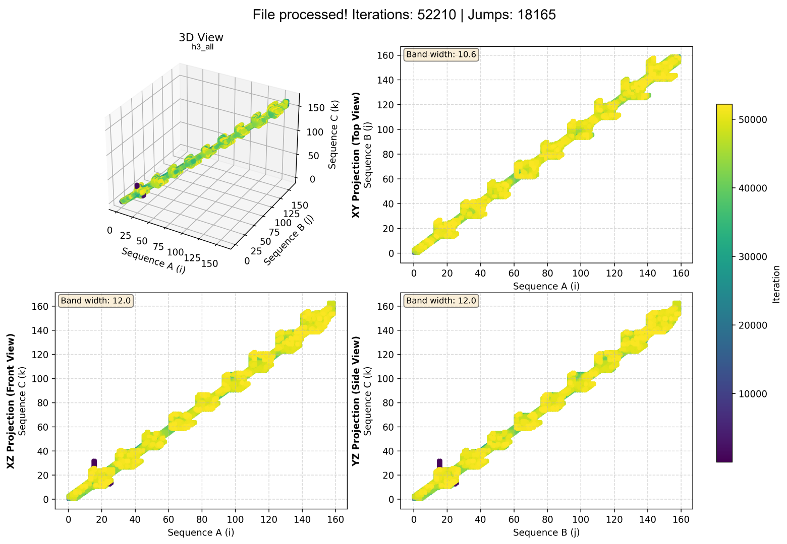

# PA-Star Runtime Visualizer

#### forked from edufrma/pa-star-rv

An interactive 3D visualization tool for analyzing execution logs from the PA-Star (Parallel A-Star) algorithm applied to the Multiple Sequence Alignment (MSA) problem.

## Description

This project provides two Python tools to visualize and analyze the behavior of the PA-Star algorithm during execution:

* **pa-star-rv.py**: Full graphical user interface (GUI) for interactive 3D visualization
* **it-f.py**: Command-line tool for multi-thread comparison

The visualizer processes log files generated by [PA-Star](https://github.com/vncsmnl/astar_msa) and creates 3D plots that show the search trajectory in the state space, enabling visual analysis of the algorithm’s behavior, including exploration patterns, state jumps, and performance metrics.

## Features

### PA-Star Runtime Visualizer (pa-star-rv.py)

* Intuitive graphical interface built with Tkinter
* Interactive 3D visualization using Matplotlib
* Color mapping by temporal iteration
* Export of plots in multiple formats (PNG, JPEG, PDF, SVG)
* Automatic metric calculation:

  * Number of expansions per vertex
  * Detection of jumps between states
  * Average heuristics of neighbors
  * f, g, and h values per coordinate
* Support for PASTAR1 and PASTAR2 log formats

### Multi-thread Comparator (it-f.py)

* Performance comparison between 1, 2, 4, and 8 threads
* Side-by-side 2×2 grid visualization
* Analysis of f-values across iterations
* Optional configuration of Y-axis limits




## Installation

### Requirements

* Python 3.6 or newer
* pip (Python package manager)

### Dependencies

```bash
pip install -r requirements.txt
```

Dependencies include:

* `matplotlib` – Plot visualization
* `numpy` – Numerical computation
* `tkinter` – Graphical interface (usually included with Python)

## How to Use

### PA-Star Runtime Visualizer

#### Running with GUI

```bash
python pa-star-rv.py
```

1. Click **"Open Log File"**
2. Select a `log.txt` file
3. View the automatically generated 3D plot
4. Use the mouse to rotate and explore the visualization
5. Click **"Save Image"** to export the plot

#### Log File Format

The visualizer supports logs in the following format:

```
PA-Star Execution Log
Threads: 1
Hash: Full-Zorder
Shift: 12

0	1	Adding:	(1 0 0)	g(90) h(6913) f(7003)
0	2	Adding:	(0 1 0)	g(90) h(6913) f(7003)
...
```

Or legacy format:

```
0	1	Adding:	(1 0 0)	g - 90 (h - 6913 f - 7003)
```

### Multi-thread Comparator

#### Basic Usage

```bash
python it-f.py logs
```

This command processes `log1.txt`, `log2.txt`, `log4.txt`, and `log8.txt` from the `logs/` directory and generates a visual comparison.

#### Usage with Custom Limits

```bash
python it-f.py logs 6000 8000
```

Sets the Y-axis between 6000 and 8000 for improved visualization.

## Project Structure

```
pa-star-rv/
├── pa-star-rv.py          # Main visualizer with GUI
├── it-f.py                # Multi-thread comparator
├── requirements.txt       # Python dependencies
├── LICENSE                # Project license
├── README.md              # This file
├── logs/                  # Example logs
│   ├── log1.txt           # 1-thread execution
│   ├── log2.txt           # 2-thread execution
│   ├── log4.txt           # 4-thread execution
│   └── log8.txt           # 8-thread execution
└── astar_msa/             # PA-Star source code (C++)
    ├── bin/               # Compiled executables
    ├── src/               # Source code
    ├── seqs/              # Test sequences
    └── README.md          # PA-Star documentation
```

### Limitations

* Supports only 3D visualization (3 sequences)
* For logs with more than 3 dimensions, an informational message is shown
* Very large log files may take time to process

## Calculated Metrics

| Metric                | Description                                 |
| --------------------- | ------------------------------------------- |
| **Iterations**        | Total number of node expansions             |
| **Jumps**             | Transitions between non-adjacent nodes      |
| **Expansions**        | How many times each coordinate was expanded |
| **Average Heuristic** | Mean h-values of neighboring states         |
| **f/g/h Values**      | Cost values computed for each state         |

---

**Note:** To run the PA-Star algorithm and generate new logs, see the documentation at [PA-Star](https://github.com/vncsmnl/astar_msa) in `astar_msa/README.md`.

Thanks to edufrma.
