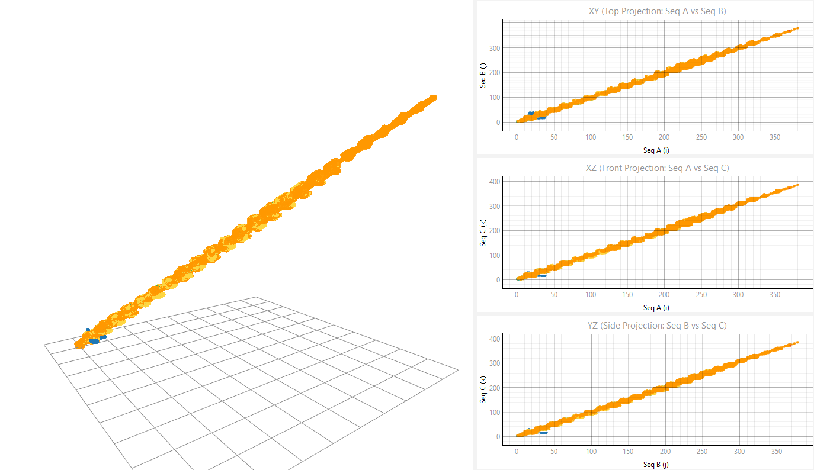
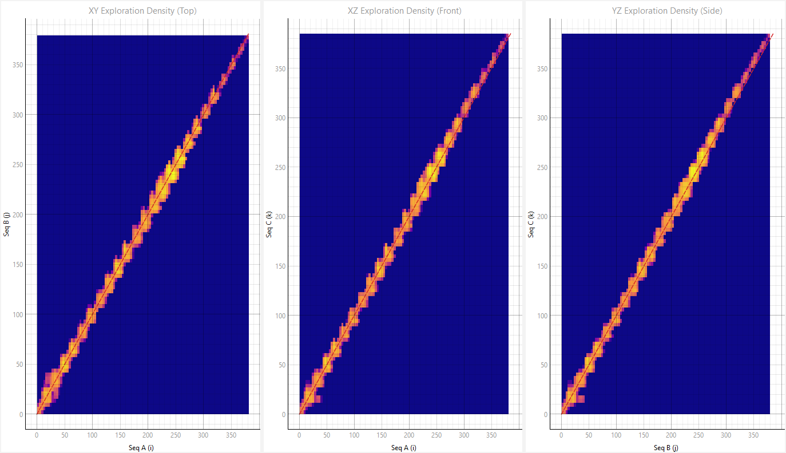
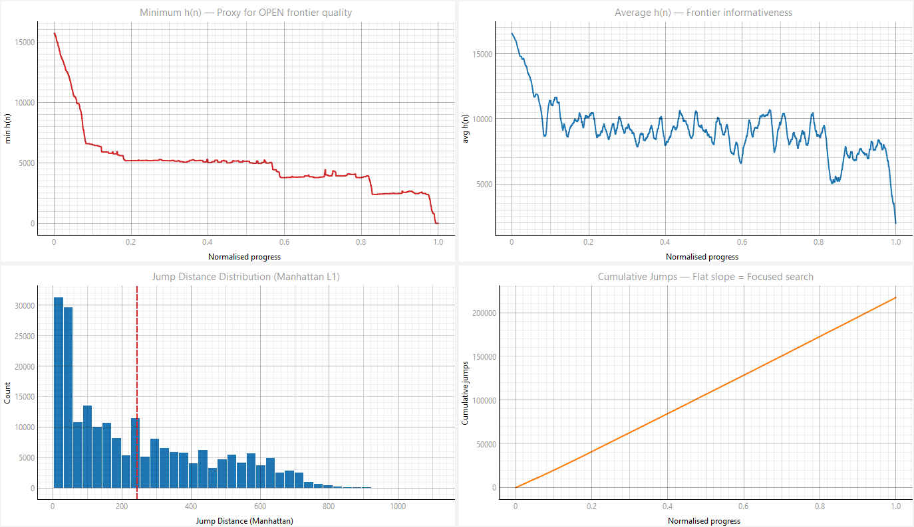
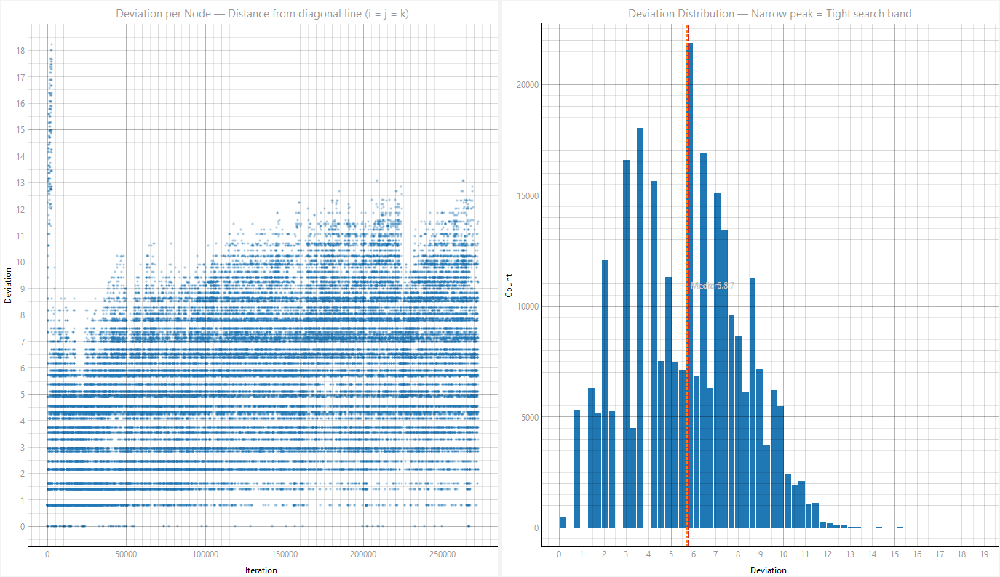
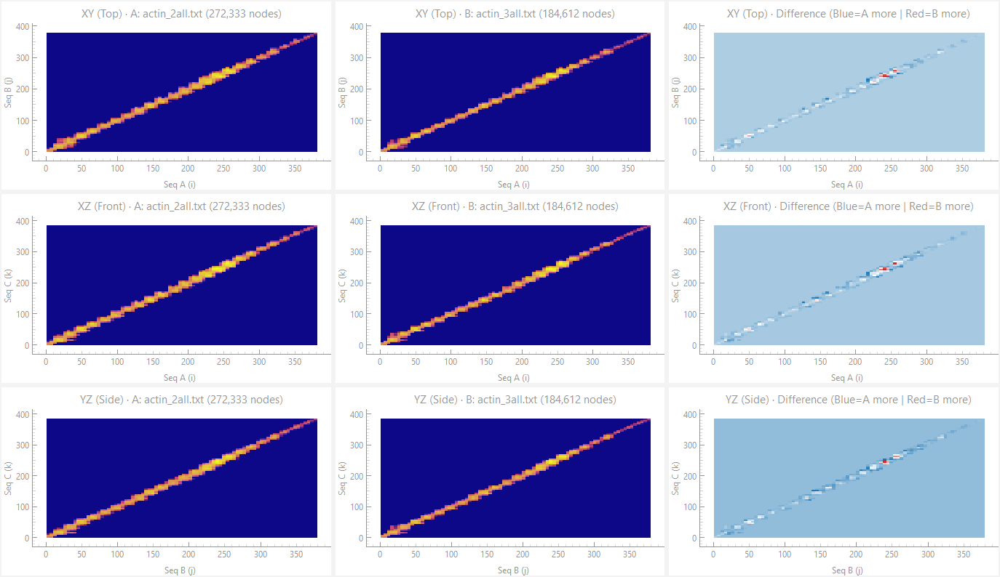
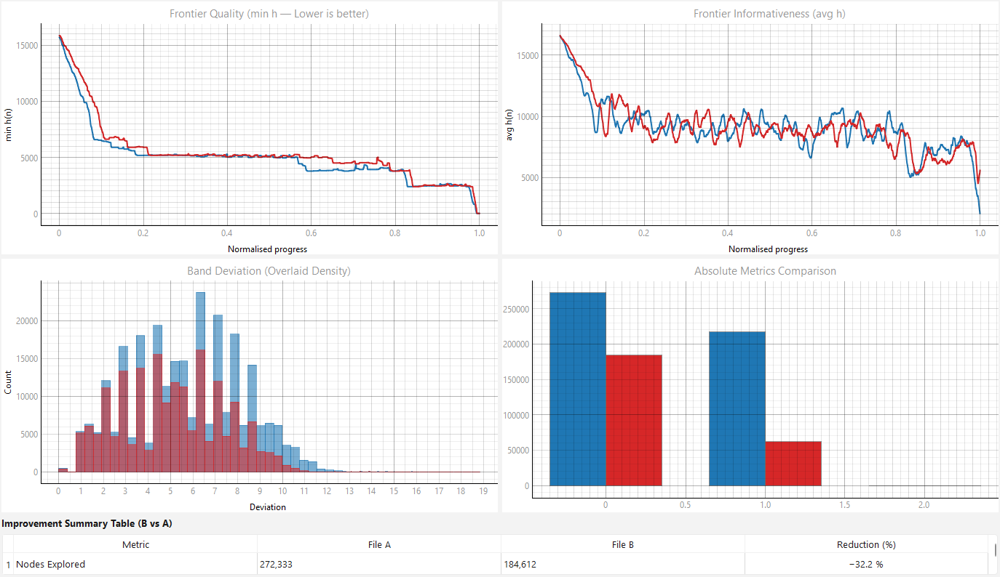

# PA-Star Runtime Visualizer (`pa-star-rv`)

A visual and quantitative runtime analysis tool for evaluating the execution dynamics of the **PA-Star** (Parallel A*) algorithm applied to the **Multiple Sequence Alignment (MSA)** problem.

*Read this in other languages:* [Português](README.md)


## Overview

`pa-star-rv` enables the investigation of the 3D state space exploration dynamics generated during parallel PA-Star execution. The tool consumes execution logs and provides quantitative metrics regarding performance, principal diagonal deviation, thread jump patterns, and cost function evolution $f(n) = g(n) + h(n)$.

---

## Visualization Modules

The system is organized into six interactive analytical modules:

### 1. 3D Trajectory & Projections (`classic`)
Displays the 3D search trajectory in alignment state space with iteration-based temporal color mapping alongside orthogonal 2D projections onto the $XY$, $XZ$, and $YZ$ planes.



### 2. Exploration Density (`density`)
Heatmap visualization of node expansion frequencies across the discrete grid, highlighting high-convergence regions and search stagnation.



### 3. Search Dynamics (`dynamics`)
Temporal evolution of cost metrics: g-score $g(n)$, h-score $h(n)$, and f-score $f(n)$, alongside iteration-level jump counts.



### 4. Diagonal Band Deviation (`band`)
Measures the Euclidean distance of expanded states relative to the main diagonal ($i = j = k$), serving as a key metric for evaluating search-band heuristics.



### 5. State Space Footprint (`footprint`)
Spatial footprint representation illustrating the geometric boundaries and coverage of visited states in 3D space.



### 6. Comparative Analysis (`compare`)
Enables side-by-side loading of two execution logs (Log A vs Log B) to assess the impact of thread count variations, hash partitioning strategies, and shift parameters.



---

## Calculated Metrics

| Metric | Academic / Computational Description |
| :--- | :--- |
| **Iterations ($N$)** | Total number of node expansions performed in state space. |
| **Thread Jumps** | Spatial discontinuities caused by context switches between threads or hash partitions (Manhattan distance $> 1$). |
| **Band Deviation ($\text{Dev}$)** | Perpendicular Euclidean distance between node coordinates $(x, y, z)$ and the main alignment diagonal. |
| **Cost Functions ($g, h, f$)** | Accumulated cost $g(n)$, heuristic estimate $h(n)$, and total cost $f(n) = g(n) + h(n)$ across iterations. |

---

## Input Log Format

The visualizer parses `.txt` execution logs generated by PA-Star structured with the following header and tab-delimited format:

```text
PA-Star Execution Log
Threads: 4
Hash: Full-Zorder
Shift: 12

0	1	Adding:	(1 0 0)	g(90) h(6913) f(7003)
0	2	Adding:	(0 1 0)	g(90) h(6913) f(7003)
...
```

---

## Project Structure

```text
pa-star-rv/
├── pa-star-rv.py          # Main application (PyQt6 GUI)
├── parser.py              # High-performance vectorized log parser (NumPy)
├── widgets/               # PyQtGraph / Matplotlib graphical modules
│   ├── canvas_3d.py       # 3D trajectory and projections
│   ├── canvas_density.py  # Exploration density heatmap
│   ├── canvas_dynamics.py # f, g, h search dynamics
│   ├── canvas_band.py     # Diagonal band deviation
│   ├── canvas_footprint.py# State space footprint
│   └── canvas_comparison.py# Dual-log comparative analysis (A vs B)
├── assets/                # Screenshots and demonstration figures
├── logs/                  # Sample execution log files
├── README.md              # Portuguese documentation
├── README_EN.md           # English documentation
└── requirements.txt       # Python dependencies
```

---

## Requirements & Installation

### Prerequisites
* Python 3.8+

### Installation
```bash
pip install -r requirements.txt
```

Main dependencies:
* `PyQt6` / `PyQt5` — GUI framework with OpenGL acceleration support.
* `pyqtgraph` — High-performance 2D/3D visualization engine.
* `matplotlib` — Map rendering and auxiliary plotting.
* `numpy` — Vectorized C-contiguous array processing.

---

## Usage

Launch the graphical user interface by running:

```bash
python pa-star-rv.py
```

1. Click **"📂 Open Log A"** to load a primary log file.
2. (Optional) Click **"📂 Open Log B"** to load a secondary log file for comparative analysis.
3. Switch between tabs to explore different analytical dimensions.
4. Click **"💾 Save Current Tab"** or **"💾 Export All Tabs"** to export high-resolution figures.
