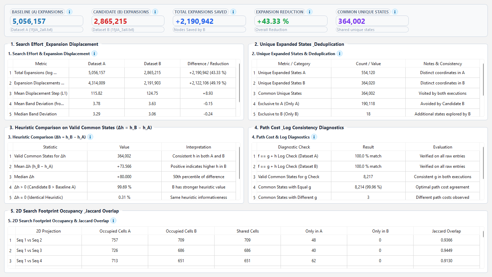
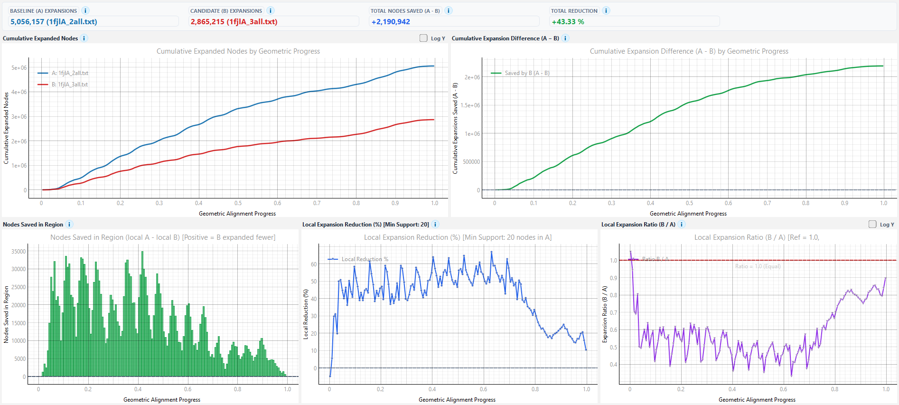
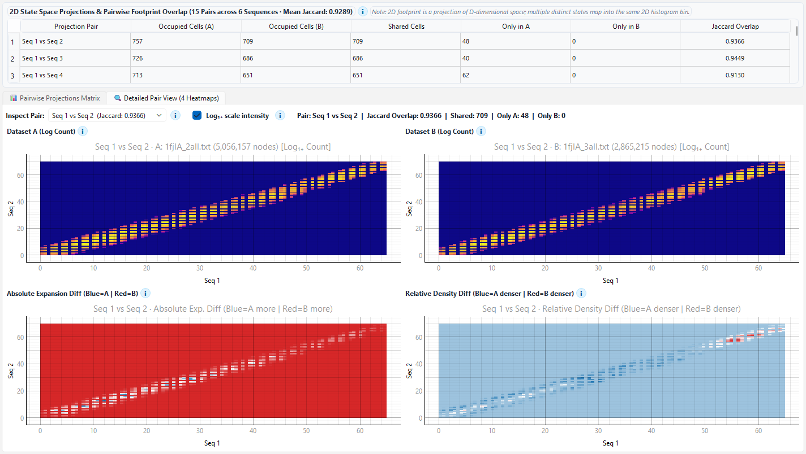
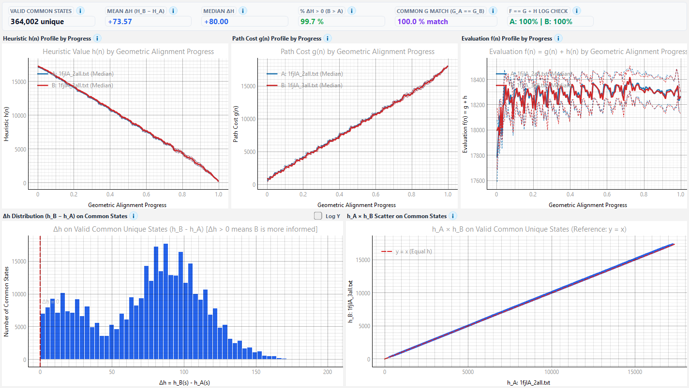
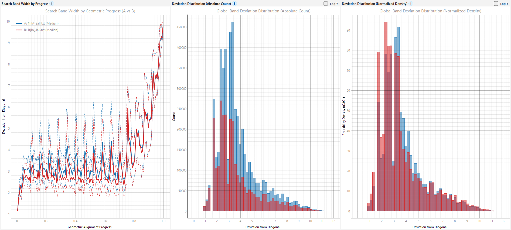
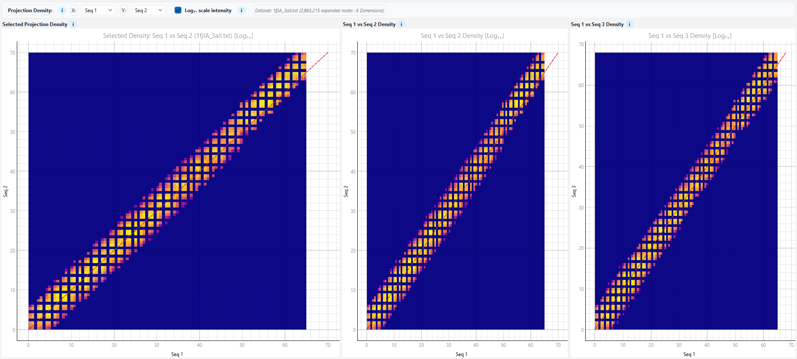
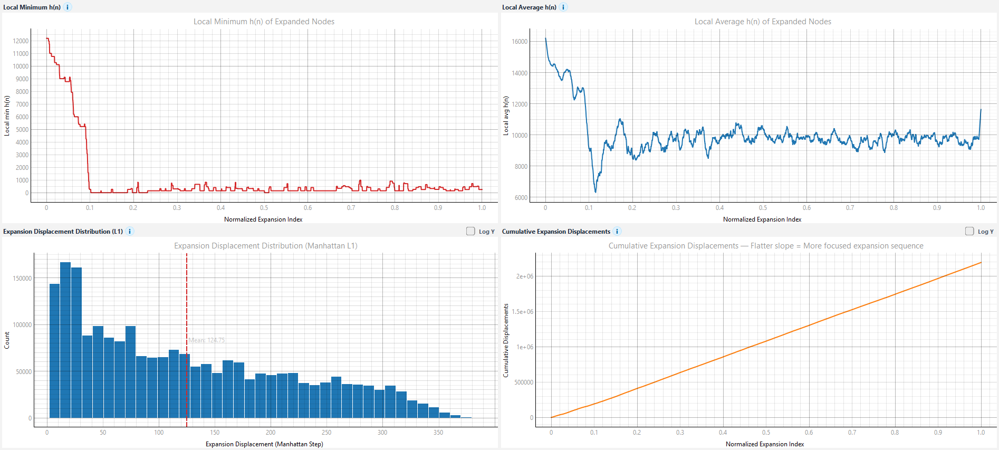
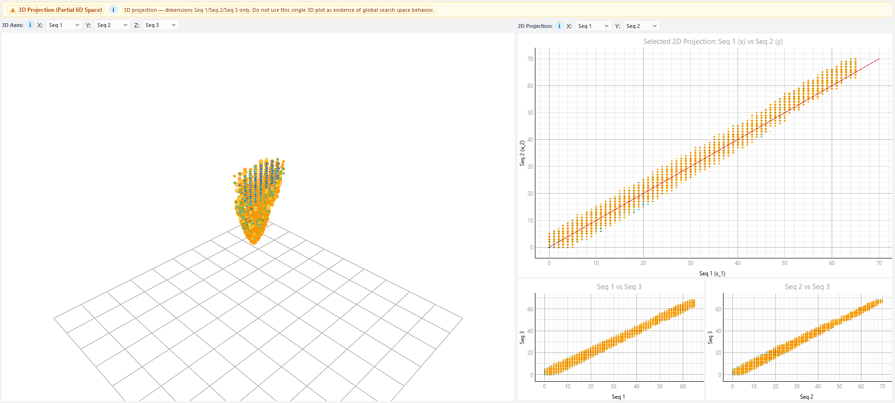

# PA-Star Runtime Visualizer (`pastar-rv`)

Runtime visual and quantitative analysis tool for rigorous evaluation and comparison of the **PA-Star** (Parallel A*) algorithm on the **Multiple Sequence Alignment (MSA)** problem.

*Leia isto em português:* [Português](README.md)

---

## Overview

`pastar-rv` enables deep investigation into spatial and heuristic search dynamics in PA-Star executions (e.g., comparing heuristic configurations such as `2all` vs `3all` or parallelism and hashing strategies).

The tool efficiently handles logs containing millions of nodes using pure vectorized NumPy routines, strictly separating mathematical analysis on complete data from downsampling used purely for graphical rendering.

---

## Analytical Visualization Tabs

The application is structured into eight analytical tabs:

### 1. Executive Summary (`Summary`)



Complete dashboard with KPI cards and structured tables:
- **Search Effort**: Total recorded expansions, nodes saved ($N_A - N_B$), and percentage reduction.
- **Unique States & Deduplication**: Distinct state counts in A and B, common unique state intersection, exclusive states (Only A / Only B), and internal consistency checks for $h$ and $g$.
- **Heuristic Advantage**: Comprehensive $\Delta h = h_B(s) - h_A(s)$ statistics on valid common states.
- **Diagnostics**: Pre-deduplication $f(n) == g(n) + h(n)$ verification and path cost consistency ($g_A == g_B$).
- **Footprint Occupancy**: Occupied cell counts and Jaccard overlap for $XY$, $XZ$, and $YZ$ projections.

### 2. Search Savings (`Search Savings`)



Effort reduction profiles across **Geometric Alignment Progress**:
- *Cumulative Expanded Nodes by Geometric Progress* (A vs B).
- *Cumulative Expansion Difference by Geometric Progress* ($cum_A - cum_B$).
- *Nodes Saved in Region* (Binned bar chart of local expansion difference).
- *Local Expansion Reduction (%)* and *Local Expansion Ratio (B / A)* with statistical support masking.

### 3. State Space Footprint (`Search Footprint`)



Generalized pairwise analysis across all $\binom{D}{2}$ projection pairs with matrix visualization:
- **Pairwise Projections Matrix**: Upper-triangular matrix displaying the Absolute Expansion Difference for all projection pairs (e.g., 15 pairs for $D=6$).
- **Detailed Pair View**: Interactive selector with 4 high-resolution heatmaps (A, B, Absolute Expansion Difference with zero-centered RdBu colormap, and Relative Density Difference).
- Dynamic occupancy and Jaccard overlap table for all pairs.

### 4. Heuristic Behaviour (`Heuristic Behaviour`)



Detailed evaluation function analysis across $D$-dimensional geometric space:
- Profiles of $h(n)$, $g(n)$, and $f(n)$ across geometric progress (medians and P25/P75 percentiles).
- Histogram of $\Delta h = h_B(s) - h_A(s)$ on valid common states in $D$-dimensional space.
- Scatter plot of $h_A \times h_B$ with diagonal reference line $y = x$.

### 5. Search Band (`Search Band`)



Measures Euclidean distance from the main diagonal ($i = j = k = \dots$) in $D$-dimensional space:
- Search band width profile by geometric progress (P25, median, P75, P90 for A and B).
- Global deviation distributions in absolute count and normalized probability density.

### 6. Exploration Density (`Exploration Density`)



Heatmaps of expansion frequency with dimension selectors ($X: S_i, Y: S_j$) and reference diagonal for any projection in $D$-dimensional space.

### 7. Expansion Dynamics (`Expansion Dynamics`)



- Local minimum $h(n)$ of expanded nodes.
- Local average $h(n)$ of expanded nodes.
- Expansion displacement step distribution (Manhattan $L_1$).
- Cumulative expansion displacements.

### 8. State Space Projections (`State Space Projections`)



Adaptive OpenGL-accelerated visualizer:
- **$D = 3$**: Enables full 3D state space with badge indicating $(x, y, z)$ represents the complete state without loss.
- **$D > 3$**: Displays explicit warning banner indicating partial 3D projection ($S_i \times S_j \times S_k$ only), noting that it should not be used as global search space evidence.
- **Dimension Selectors**: Dynamic dropdowns for 3D axes and 2D projection ($X: S_i, Y: S_j$), enabling inspection of any of the $\binom{D}{2}$ pairwise projections with iteration time gradients and diagonal lines.

---

## CLI Validation & Benchmarking (`pastar-validate`)

A standalone CLI tool is included for mathematical validation and benchmarking without GUI overhead:

```bash
uv run pastar-validate logs/1fjlA_2all.txt logs/1fjlA_3all.txt
```

Reports:
- Execution time and process memory (RSS).
- Intersection strategy benchmarks.
- Quantitative analysis of search effort, unique states, $\Delta h$, occupancy, and diagnostics.

---

## Concepts & Definitions

| Concept | Definition |
| :--- | :--- |
| **Expansion Count** | Total number of node expansion records in the log. |
| **Unique Expanded States** | Number of distinct coordinates explored in state space. |
| **Occupied Cells** | Number of occupied 2D histogram bins in a projection (not synonymous with unique states). |
| **Geometric Alignment Progress** | Normalized geometric projection into alignment space $\frac{1}{D}\sum \frac{\text{coord}_d}{\text{ref}_d}$ (not execution time or search depth). |
| **$\Delta h$ on Common States** | Difference $h_B(s) - h_A(s)$ computed only on exact common coordinates consistent in both runs. |

---

## Project Structure

```text
pa-star-rv/
├── pyproject.toml              # Central uv config, dependencies, ruff and scripts
├── uv.lock                     # Deterministic uv lockfile
├── src/
│   └── pastar_rv/             # Main package
│       ├── __init__.py
│       ├── __main__.py        # Executable via python -m pastar_rv
│       ├── app.py             # Main GUI application (MainWindow)
│       ├── parser.py          # Vectorized log parser
│       ├── metrics.py         # Pure NumPy analysis and metrics module
│       ├── cli.py             # Standalone CLI validation and benchmark script
│       └── widgets/           # PyQtGraph / OpenGL canvases
│           ├── __init__.py
│           ├── canvas_3d.py
│           ├── canvas_band.py
│           ├── canvas_density.py
│           ├── canvas_dynamics.py
│           ├── canvas_footprint.py
│           ├── canvas_heuristic.py
│           ├── canvas_savings.py
│           └── canvas_summary.py
├── tests/                     # Unit and integration test suite
│   ├── __init__.py
│   ├── test_metrics.py        # Unit tests for metrics module
│   └── test_gui_integration.py# Integration tests for widgets and MainWindow
├── assets/                    # Screenshots and demo images
└── logs/                      # Sample execution logs
```

---

## Requirements & Installation

### Prerequisites
* Python 3.10+
* [uv](https://docs.astral.sh/uv/)

### Installation
```bash
uv sync
```

---

## Running the Application

### Graphical User Interface
```bash
uv run pastar-rv
```

### Running Automated Tests
```bash
uv run pytest
```

### Code Quality (Lint & Format)
```bash
ruff check .
ruff format --check .
```
